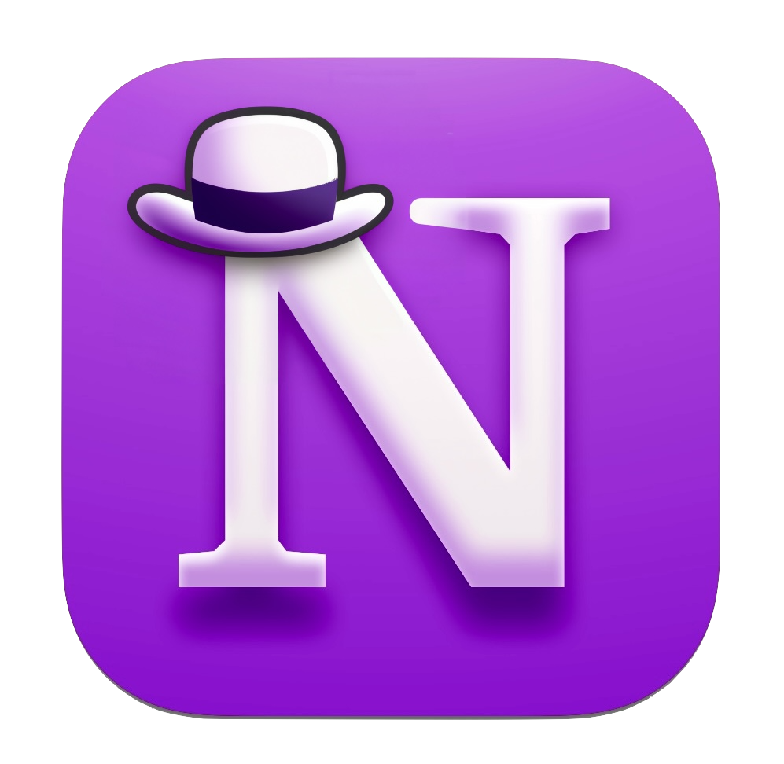
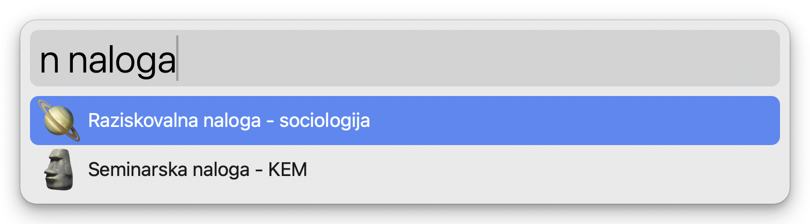

#  Notion Search Workflow for Alfred

## 🤔 What is it?

- This workflow enables you to perform online and offline searches of your Notion pages.
- It requires a Notion integration (API key).

## 🌟 Features

- **Online Search**: Search your Notion pages online for the most up-to-date information.
- **Offline Search**: Search through a locally stored copy of your pages for quick access.
- **Data Update**: Update your local data at your convenience to ensure accurate offline searches of your pages.

## 🚀 Getting Started

### Installation

1. Install [⤓ Notion Search Workflow](https://github.com/svenko99/alfred-notion/releases/latest/download/Notion.search.alfredworkflow) in the repo. Double click on it and Alfred app should open with installation of the workflow. You will be prompted to put `Notion API key (of the integration)`. Follow steps in `2.` to get the API key.

2. Follow this [instructions](https://www.notion.so/help/create-integrations-with-the-notion-api#create-an-internal-integration) to create an internal integration and put the `Internal Integration Token` into the `Notion API key (of the integration)` which you will find in the `Configure Workflow...` in Alfred app. There you will also find a checkbox if you wish that links of the pages are opened in the browser or in the Notion app.

3. Navigate to the Notion page you want to make searchable. Click the three dots in the upper right corner, select `Add connections`, and choose the integration you just created. _(This step is only necessary for main pages on the left side of Notion, as subpages inherit the connection. Refer to [clearer instructions](https://developers.notion.com/docs/create-a-notion-integration#give-your-integration-page-permissions).)_

5. Now the setup is complete and the workflow should work. I recommend running the data update `nupdate` first to ensure offline search functionality.

## 🔄 Usage

- **Online Search**: Type `n` followed by your search query to search your Notion pages online.
- **Offline Search**: Type `ns` followed by your search query to search your Notion pages offline.
- **Data Update**: Type `nupdate` and enter to update your local data for offline searches. I suggest to do that firstly when you download the workflow.
  
  
