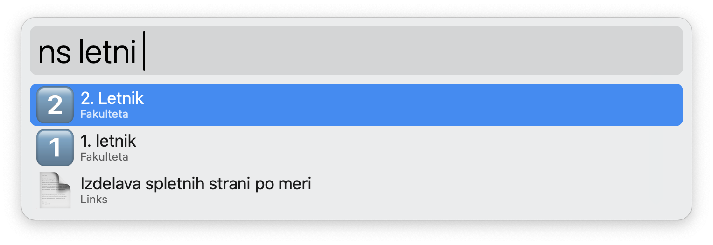

#  Notion Search Workflow for Alfred

## 🤔 Introduction

- This Alfred workflow enables you to perform online and offline searches of your Notion pages.
- It requires a Notion integration (API key).

## 🌟 Features

- **Online Search**: Search your Notion pages online for the most up-to-date information.
- **Offline Search**: Search through a locally stored copy of your pages for quick access.
- **Data Update**: Update your local data at your convenience to ensure accurate offline searches of your pages.
- **Opening Page in a New Tab**: Open the selected page in a new tab in Notion app.

## 🚀 Installation

1. Install [⤓ Notion Search Workflow](https://github.com/svenko99/alfred-notion/releases/latest/download/Notion.search.alfredworkflow) in the repo. Double click on it and Alfred app should open with installation of the workflow. You will be prompted to put `Notion API key (of the integration)`. Follow steps in `2.` to get the API key.

2. Follow this [instructions](https://www.notion.so/help/create-integrations-with-the-notion-api#create-an-internal-integration) to create an internal integration and put the `Internal Integration Token` into the `Notion API key (of the integration)`.

3. Follow this [instructions](https://developers.notion.com/docs/create-a-notion-integration#give-your-integration-page-permissions) to give your integration premission to search for pages. You only need to give premission to the main pages on the left side of Notion, as subpages inherit the premission.

4. Now the setup is complete and the workflow should work. I recommend running the data update `nupdate` first to ensure offline search functionality.

## 🔧 Workflow variables

|Variable   |Type   |Description   |
|---|---|---|
|Notion API key (of the integration)|Text Field   |This is a text field where you input the API key required for the integration with Notion. (e.g. `secret_WmzOfHiLeipQKPiRd5GsdVlwXXcgP3I44GdoreruIV`)    |
|Use desktop client|Checkbox   |A checkbox indicating whether to open links in the desktop client or in the browser.    |
|Enable custom images   | Checkbox   |A checkbox to enable or disable the downloading of custom Noiton page icon images.|

## 🔄 Usage

- **Online Search**: Type `n` followed by your search query to search your Notion pages online (If you press ⇧ + ⏎ it will open the page in a new tab in the Notion app).
- **Offline Search**: Type `ns` followed by your search query to search your Notion pages offline (If you press ⇧ + ⏎ it will open the page in a new tab in the Notion app).
- **Data Update**: Type `nupdate` and enter to update your local data for offline searches. I suggest to do that firstly when you download the workflow.

  - ⚠️ **Note**: Running `nupdate` for the first time, especially with the option `Enable custom images` checked, may take some time, particularly if you have a large number of custom images.
  - ⚠️ **Note**: To make sure opening a page in a new tab works, you must toggle off the setting `New Tab Search` located in `My settings` in Notion app.

  
